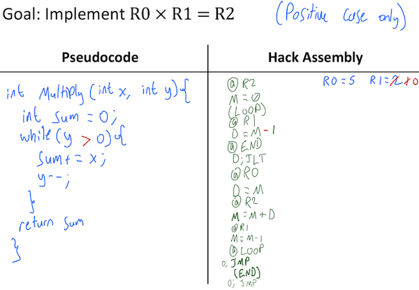

I'm a junior Computer Science student at the University of Washington with an expected graduation date of Spring 2024.  Additionally I was a teachers assistant for the Fall 2022 offering of [CSE 390Z](https://courses.cs.washington.edu/courses/cse390z/22au/).  Studying and teaching Computer Science here has required me to embrace a growth mindset, learn metacognitive skills, and apply them when learning technical skills.

**Metacognitive Skills**

*Building Connections*

At UW, one metacognitive skill I have been applying is building connections with peers, staff, and grad students.  This metacognitive skill is important for taking care of oneself, building a social network, and building a professional network.  This skill can be applied by going to social events, professional events, and joining clubs.  One way I applied this skill was by attending an an [Ability](https://ability.cs.washington.edu) Research Night.  I met [Jesse Martinez](https://homes.cs.washington.edu/~jessejm/), a PhD student at UW and a contributor to the [Makeability Lab](https://makeabilitylab.cs.washington.edu/member/jessemartinez/).  We scheduled a zoom meeting and we had a discussion about his contributions to the Makeability Lab at UW in creating accessible games for people to play.  A sample from this meeting:
* Jesse uses the following methodology to determining accessibility needs for games.
  + Starting with the most simple case: he's trying to play a game with a friend with disability, as the resident games person he's trying to host Accessible Game Nights and get people to play a game.  Usually choosing the game arbitrarily depending on what can be played accessibly vs what we want to play.  He is finding ways to make the games he owns be more accessible to his friends.  Some questions he asks are:
    - What are the different mechanics of the game?  
    - What is not blind accessible?  
    - What is not deaf accessible?
    - Thinking of tools to create easy fixes for games (carving letters into tiles for games).
    - Thinking of my friends specific needs.
* Jesse has done work with the Makeability lab add in accessibility options to Android educational games.
  + By looking at Android educational games and ability to access via accessibility switches (interact without touching the screen).  Many mobile games don't have any selectable targets so switches are useless for them.
  + This is accomplished using middleware to modify the game-play experience.
    - This is built on top of software already built for non games to enhance touch targets to be selectable via an accessibility switch.
Being a student at UW has helped me to become more confident in my ability to make social connections both professionally and personally.  I can improve upon building connections by committing more to non academic events, in particular with events hosted by student organizations and my friends.  Having well rounded social connections is an important part of living a balanced life.

*Cornell Notes*

Another important skill to succeed at the Allen School is using [Cornell Notes](https://lsc.cornell.edu/wp-content/uploads/2016/10/Cornell-NoteTaking-System.pdf).  What Cornell Notes do is heighten note taking to take advantage of [Bloom's Taxonomy](https://cft.vanderbilt.edu/guides-sub-pages/blooms-taxonomy/) by including questions and summaries into notes for a lecture.  By taking notes in this manner, I have retained more information from lecture and been able to know when to apply the information appropriately on projects.  An example of my Cornell notes on using loads in computer architecture are provided here. 

Some ways I can improve on my Cornell Notes are writing the summary section before it is time to study for finals.  Ideally in the following 15 minutes after class when the concepts are still fresh in my mind.  This will further boost my retention of knowledge as I continue my education.

**Technical Skill**

*HACK Assembly*
{: .align-right}
One technical skill I learned at the Allen School is Assembly Language, both x-86 and HACK Assembly.  HACK Assembly is a low level language created for the [NAND2Tetris Project](https://www.nand2tetris.org/software) to write low level code for their HACK Computer.
  * This computer has 3 registers available for programming.
    + The D (data) register holds any numeric data passed into the register.
    + The A (address) register holds any numeric data passed in or assigned to it, the A register is also used to reference locations in memory in the hack computer.
    + The M (memory) register contains the data that the A register references to in memory.  In other words, the M register is the dereference of the A register.
  * Hack Assembly supports a handful of functions used by these 3 registers.
    + Hack Assembly allows for literals to be assigned to the A register using the syntax "@value", but not for any other register, which require values to be passed in.
    + Hack assembly supports simple arithmetic computations such as adding, subtracting, incrementing, and decrementing the registers.
    + Hack assembly supports Jump commands in the syntax "@Label", "RegisterName; JumpType" all separated by new lines with no commas.
  * With these simple commands the HACK computer requires most logic to be implemented in software.  I will provide an example of software I wrote by hand that multiplies the value of two positive integers and stores them in memory.

Some ways I can improve my HACK Assembly writing skills is tracing through the code I have written and debugging it using the CPUEmulator tool provided with Nand2Tetris.  Generally debugging by hand is tedious and error prone, since some faults cannot be detected tracing code by hand.  Debugging properly is a useful skill we cover extensively at the Allen School and outside of the scope of this article.

**Life at Allen School**

Learning about computers on a low level is important in fostering a deeper understanding of how they work, what can go wrong, and how to write code that is more optimized for computers.  Being a student at The Allen School is a great opportunity to grow as a person, an academic, and a developer.  These skills are highly transferrable to life inside and outside of tech.  Allen School students learn to become self disciplined, motivated, and excellent technical communicators through the programs rigorous curriculum.  I am very fortunate to have the opportunity to study here.